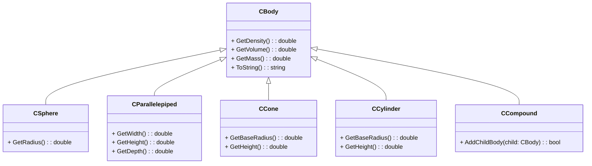

#### Вариант 1 – 120 баллов

Разработайте классы следующей иерархии объемных тел (для устранения дублирования кода может потребоваться вынесение одинаковой реализации методов простых тел в дополнительный базовый класс (например, CSolidBody)):

Каждое объемное тело обладает некоторым объемом, однородной плотностью и массой. Исключение составляет класс `CCompound`, моделирующий составное тело, состоящее из нескольких непересекающихся объемных тел, плотность которого не является однородной. Средняя плотность составного тела может быть вычислена как отношение массы составляющих его тел к их суммарному объему.

**Масса простого тела** вычисляется через произведение его плотности и объема. **Масса составного тела** вычисляется через массу составляющих его частей.

При реализации метода добавления тела внутрь составного тела необходимо обрабатывать ситуацию с возможным зацикливанием, т. е. прямым или опосредованным добавлением составного объекта внутрь себя самого.

Программа должна считывать информацию об имеющемся наборе объемных тел из стандартного потока ввода (предусмотреть возможность ввода информации о составных объемных телах) и сохранять их в vector (в данном случае контейнер vector должен хранить указатели на CBody. Лучше всего воспользоваться умными указателями типа std::shared_ptr (boost::shared_ptr при его отсутствии), unique_ptr или контейнером boost::ptr_vector). Для простых тел пользователь вводит геометрические размеры фигуры и её плотность. Объем и массу тела программа должна вычислять самостоятельно. Для составных тел пользователь должен параметры вводимых тел внутри составного. Предусмотреть возможность произвольной глубины составных тел друг в друга.

В программе должна быть выделена функция, позволяющая найти тело **с наибольшей массой**, а также функция, позволяющая найти тело, которое будет **легче всего весить, будучи полностью погруженным в воду** (легче всего в воде будет весить тело, для которого величина $F_{тяжести}-F_{архимеда}$=($ρ_{тела}-ρ_{воды}$)gV будет минимальной. Это не обязательно будет тело с наименьшей массой, плотность воды принять равной 1000 кг/м3). Предполагается, что все тела, в том числе и всплывающие в воде, можно полностью погрузить в воду, чтобы узнать их вес в воде.

После ввода всех фигур программа должна вывести подробную информацию обо всех телах (составные тела должны выводить подробную информацию о содержащихся в них дочерних телах). Отдельно вывести информацию о теле с наибольшей массой, а также о теле, которое меньше всего весит в воде.

Возможна сдача работы без поддержки составных объемных тел. В этом случае работа будет принята с коэффициентом 0,7.

**В комплекте с программой должны обязательно поставляться файлы, позволяющие проверить ее работу автоматически**. Без них работа будет принята с коэффициентом 0.6 (коэффициент применяется к остальным коэффициентам).