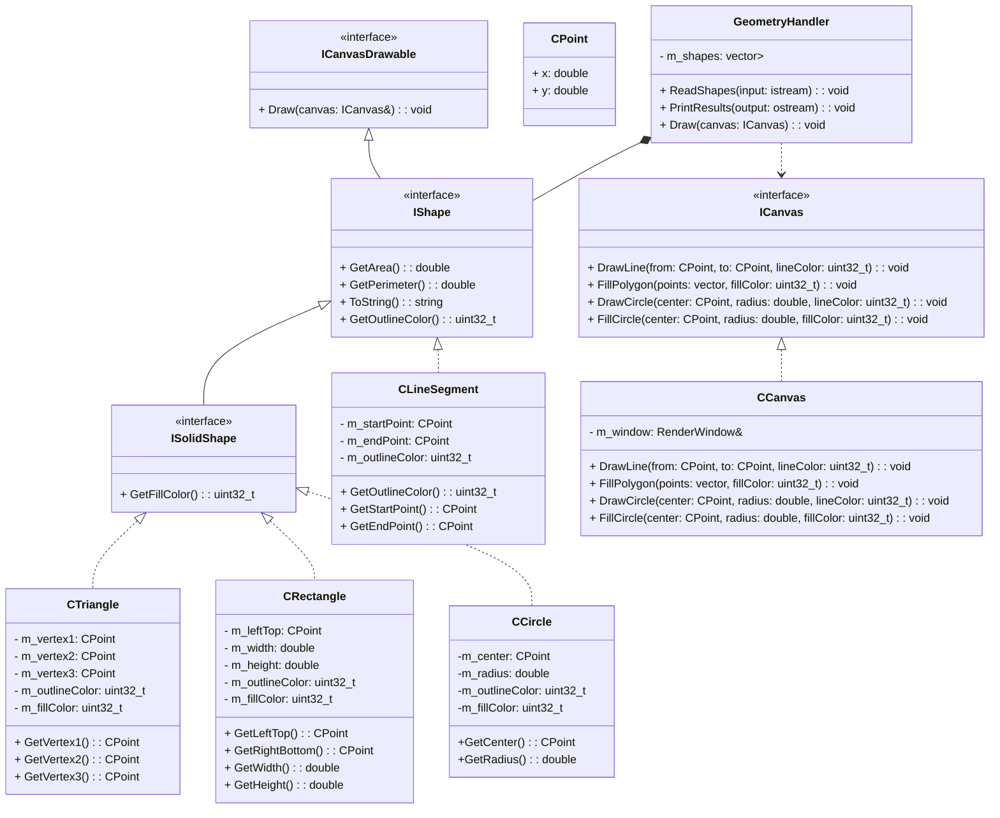

#### Вариант 2 – 100 баллов

Разработайте классы и интерфейсы следующей иерархии геометрических фигур:


```mermaid
classDiagram
    class ICanvasDrawable {
        <<interface>>
        + Draw(canvas: ICanvas&): void
    }

    class ICanvas {
        <<interface>>
        + DrawLine(from: CPoint, to: CPoint, lineColor: uint32_t): void
        + FillPolygon(points: vector<CPoint>, fillColor: uint32_t): void
        + DrawCircle(center: CPoint, radius: double, lineColor: uint32_t): void
        + FillCircle(center: CPoint, radius: double, fillColor: uint32_t): void
    }

    class CCanvas {
        - m_window: RenderWindow&
        + DrawLine(from: CPoint, to: CPoint, lineColor: uint32_t): void
        + FillPolygon(points: vector<CPoint>, fillColor: uint32_t): void
        + DrawCircle(center: CPoint, radius: double, lineColor: uint32_t): void
        + FillCircle(center: CPoint, radius: double, fillColor: uint32_t): void
    }

    class CPoint {
        + x: double
        + y: double
    }

    class IShape {
        <<interface>>
        + GetArea(): double
        + GetPerimeter(): double
        + ToString(): string
        + GetOutlineColor(): uint32_t
    }

    class ISolidShape {
        <<interface>>
        + GetFillColor(): uint32_t
    }

    class CLineSegment {
        - m_startPoint: CPoint
        - m_endPoint: CPoint
        - m_outlineColor: uint32_t
        + GetOutlineColor(): uint32_t
        + GetStartPoint(): CPoint
        + GetEndPoint(): CPoint
    }

    class CTriangle {
        - m_vertex1: CPoint
        - m_vertex2: CPoint
        - m_vertex3: CPoint
        - m_outlineColor: uint32_t
        - m_fillColor: uint32_t
        + GetVertex1(): CPoint
        + GetVertex2(): CPoint
        + GetVertex3(): CPoint
    }

    class CRectangle {
        - m_leftTop: CPoint
        - m_width: double
        - m_height: double
        - m_outlineColor: uint32_t
        - m_fillColor: uint32_t
        + GetLeftTop(): CPoint
        + GetRightBottom(): CPoint
        + GetWidth(): double
        + GetHeight(): double
    }

    class CCircle {
        -m_center: CPoint
        -m_radius: double
        -m_outlineColor: uint32_t
        -m_fillColor: uint32_t
        +GetCenter(): CPoint
        +GetRadius(): double
    }

    class GeometryHandler {
        - m_shapes: vector<unique_ptr<IShape>>
        + ReadShapes(input: istream): void
        + PrintResults(output: ostream): void
        + Draw(canvas: ICanvas): void
    }

    ICanvasDrawable <|-- IShape
    IShape <|-- ISolidShape
    IShape <|.. CLineSegment
    ISolidShape <|.. CTriangle
    ISolidShape <|.. CRectangle
    ISolidShape <|.. CCircle
    ICanvas <|.. CCanvas
    GeometryHandler *-- IShape
    GeometryHandler ..> ICanvas
```

С их использованием разработайте программу, считывающую информацию из стандартного потока ввода команды, описывающие
фигуры в некотором текстовом формате (придумайте сами). Например, таком:

```txt
rectangle 10.3 20.15 30.7 40.4 ff0000 00ff00
```

Данная команда описывает прямоугольник с координатами верхнего левого угла (10.3, 20.15), шириной 30.7 и высотой 40.4, с
красной обводкой (#ff0000) и зеленой заливкой внутренней области (#00ff00). Аналогичным образом могут быть описаны
команды для задания остальных фигур.

Во входном потоке может быть произвольное количество фигур (считывать до `EOF`).

Считанные фигуры должны быть сохранены в массиве в порядке их считывания.

В программе должна быть функция, позволяющая найти среди массива фигур ту, которая имеет наибольшую площадь, а также
функция, позволяющая найти фигуру, имеющую наименьший периметр. После окончания считывания фигур программа должна
вывести в стандартный поток вывода информацию об этих двух фигурах. При этом должна быть выведена полная информация,
включающая в себя:

- Площадь и периметр фигуры
- Цвет обводки и заливки (при наличии)
- Данные, специфичные для конкретной фигуры (для этого удобно использовать `ToString()`)

**В комплекте с программой должны обязательно поставляться файлы, позволяющие проверить ее работу автоматически**. Без
них работа будет принята с коэффициентом 0.6.

<span style="color:gray">**Бонус в 200 баллов за визуализацию фигур**</span> <a name="1-2-b-1"></a>

Для получения бонуса добавьте в иерархию фигур возможность рисования на холсте, представленном интерфейсом `ICanvas`.
Для этого фигуры должны реализовывать интерфейс `ICanvasDrawable`.


Для рисования разработайте класс `CCanvas`, реализующий интерфейс `ICanvas` с некоторого (на Ваш выбор) графического
API (GDI, OpenGL, SFML, SDL и т.п.). Фигуры визуализируются в порядке, в котором они были введены пользователем.

**Метод Draw, реализуемый фигурами должна быть также покрыта тестами (без них будет применен коэффициент 0,6)**. Для
этого в тестах используйте реализацию интерфейса `ICanvas`, которая вместо фактического рисования позволила бы
запротоколировать рисуемые фигурой примитивы для последующего сравнения в тестах с ожидаемыми значениями. Для облегчения
создания такой реализации рекомендуется воспользоваться одним из имеющихся библиотек для создания mock-объектов. Хорошим
примером такой библиотеки для языка C++ является **FakeIt**, доступный в github-репозитории:

<https://github.com/eranpeer/FakeIt>

В комплекте с программой должен поставляться текстовый файл (или файлы), содержащий описания фигур в формате, понятном
программе. При запуске программы с перенаправлением содержимого этого файла в `stdin`, она должна нарисовать
закодированное изображение. При этом картинка, полученная при визуализации этого файла должна представлять из себя
некоторое законченное произведение, а не быть случайно разбросанными фигурами. Например, вроде такого:

